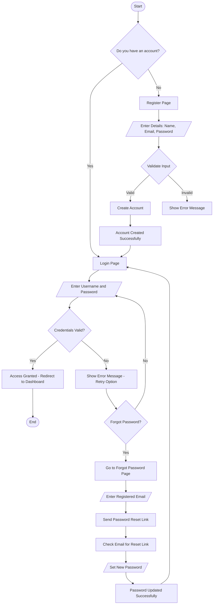
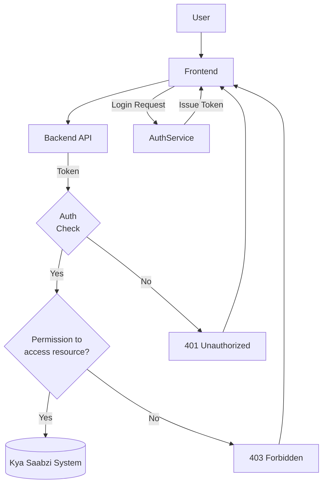

# Security

Describes how users are authenticated and authorized to ensure each can securely access only their own data.

---

## Authentication Flow

```mermaid
flowchart TD
    A(["Start"]) --> B{"Do you have an account?"}
    B -- Yes --> C["Login Page"]
    B -- No --> D["Register Page"]
    C --> E["Enter Username and Password"]
    E --> F{"Credentials Valid?"}
    F -- Yes --> G["Access Granted - Redirect to Dashboard"]
    F -- No --> H["Show Error Message - Retry Option"]
    H --> I{"Forgot Password?"}
    I -- Yes --> J["Go to Forgot Password Page"]
    I -- No --> E
    D --> K["Enter Details: Name, Email, Password"]
    K --> L["Validate Input"]
    L -- Valid --> M["Create Account"]
    L -- Invalid --> N["Show Error Message"]
    M --> O["Account Created Successfully"]
    O --> C
    J --> P["Enter Registered Email"]
    P --> Q["Send Password Reset Link"]
    Q --> R["Check Email for Reset Link"]
    R --> S["Set New Password"]
    S --> T["Password Updated Successfully"]
    T --> C
    G --> U(["End"])

    E@{ shape: lean-r}
    P@{ shape: lean-r}
    K@{ shape: lean-r}
    L@{ shape: diam}
    S@{ shape: lean-r}
```

## Authorization Flow

```mermaid
flowchart TB
    n1["User"] --> n2["Frontend"]
    n2 --> n3["Backend API"]
    n2 -- Login Request --> n7["AuthService"]
    n3 -- Token --> n4["Auth<br>Check"]
    n4 -- Yes --> n5["Permission to<br>access resource?"]
    n4 -- No --> n6["401 Unauthorized"]
    n6 --> n2
    n7 -- Issue Token --> n2
    n5 -- Yes --> n8["Kya Saabzi System"]
    n5 -- No --> n9["403 Forbidden"]
    n9 --> n2

    n1@{ shape: rect}
    n4@{ shape: diam}
    n5@{ shape: diam}
    n8@{ shape: cyl}
```