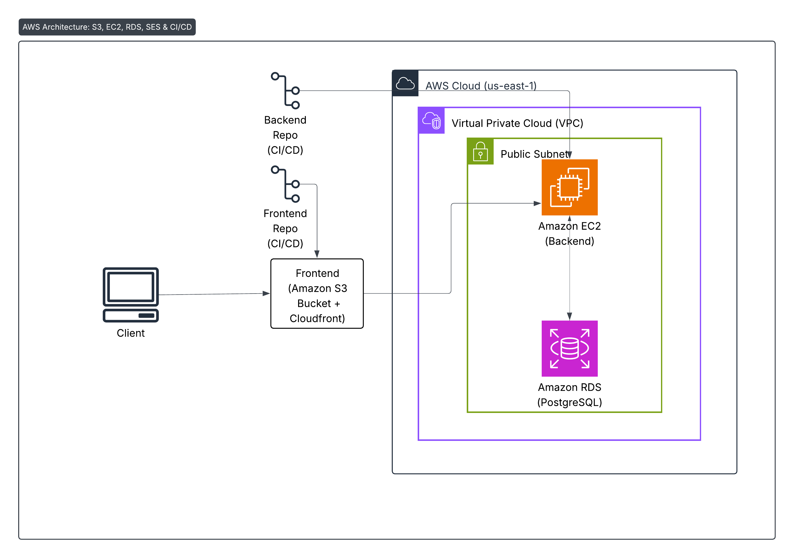

# AWS Specific Architecture

This section explains the AWS specific architecture for **Kya Saabzi** and why this architecture is chosen.

---

/// caption
AWS specific architecture
///

---

| AWS Component / Tool | Purpose in this architecture |
|----------------------|------------------------------|
| **Client / Internet** | End user using the PWA in a browser or mobile; accesses frontend over the public internet. |
| **Amazon S3 (Frontend)** | Hosts the built static PWA assets. Provides durable, low-cost static hosting for the app bundle. |
| **Virtual Private Cloud (VPC)** | Network boundary that contains the compute and database resources (subnet layout shown in diagram). |
| **Public Subnet** | The public subnet inside the VPC where internet-facing resources (as drawn) can be placed and receive traffic. |
| **Amazon EC2 (Backend)** | Runs the FastAPI backend application. Handles API requests, business logic, and talks to the database and SES. |
| **Amazon RDS (Database)** | Managed PostgreSQL instance that stores `users`, `dishes`, and `cooklogs`. Provides durable, backed-up relational storage for the app. |
| **Amazon SES (Authentication / Email)** | Used by the backend to send authentication emails, OTPs, and other transactional messages (as shown). |
| **GitHub Actions (CI/CD)** | Continuous integration / deployment pipeline that builds and deploys the backend and frontend to the AWS environment. |

---

## Cloud Environment Demonstration

## 1. Components

### **Frontend (React PWA)**

- Built with Vite.

- Compiled into static assets (HTML, CSS, JS).

- Hosted on **Amazon S3**.

- Service Worker provides caching & offline PWA features.

### **Backend (FastAPI)**

- Runs on **Amazon EC2**.

- Provides REST API (JWT Auth).

- Handles all business logic: users, dishes, cooklogs, recommendations.

### **Database (Amazon RDS – PostgreSQL)**

- Stores all persistent data.

- Runs in a public subnet.

- Automated backups and snapshots.

### **Email (Amazon SES)**

- Used for sending verification emails, OTPs, or notifications.

---
## 2. Request Flow

1. User visits: 
   `https://kysaabzi.example.com`  → S3 → loads the React app.

2. React frontend calls API: 
   `https://api.kysaabzi.example.com` → EC2 running FastAPI.

3. FastAPI reads/writes data in **RDS PostgreSQL**.

4. For authentication emails or OTP: 
   FastAPI → SES → Email sent to user.

5. Service Worker caches assets for fast loads & offline mode.

---

## 4. Deploy Checklist

1. Run tests (`pytest`, `vitest`).

2. Build frontend → upload to S3

3. Build backend → push image to registry.

4. Run Alembic migrations on RDS.

5. Deploy backend to EC2.

6. Run smoke tests (`/health`, login, create cooklog).

---

## 5. Future Scaling

- Frontend auto-scales through CloudFront.

- Backend can scale using:
    - EC2 Auto Scaling Group
    - ECS/EKS (preferred for production)

---