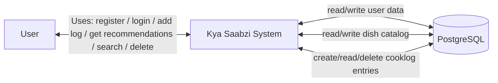
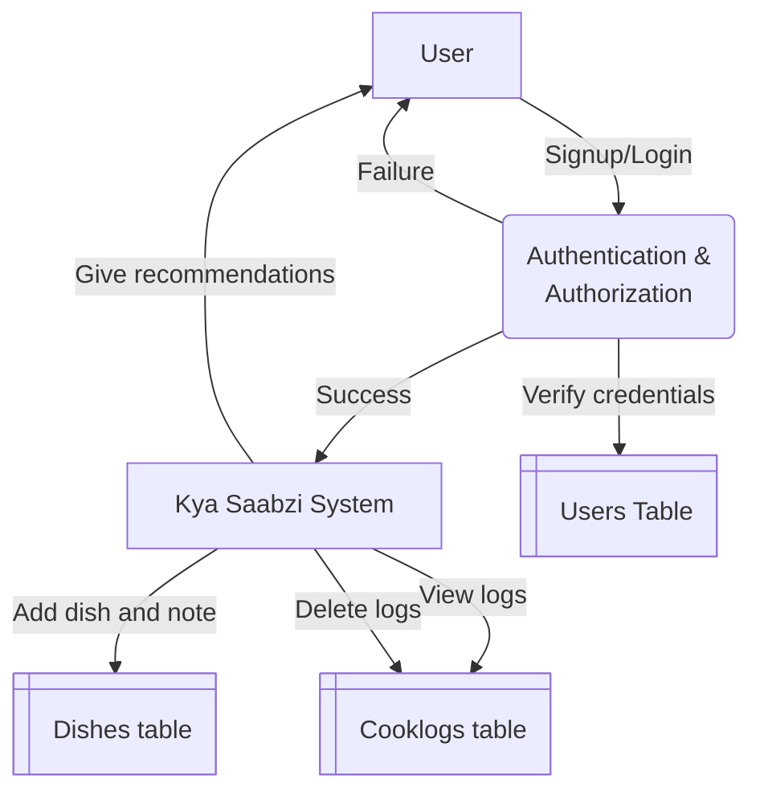

# Data Flow Diagrams

This section displays how the data flows in between the **Kya Saabzi System** and the **User**.

---

## DFD Level 0

```mermaid
flowchart LR
    User["User"] <-- Uses: register / login / add log / get recommendations / search / delete --> System["Kya Saabzi System"]
    System <-- read/write user data --> UsersDB["PostgreSQL"]
    System <-- read/write dish catalog --> UsersDB
    System <-- create/read/delete cooklog entries --> UsersDB

    UsersDB@{ shape: db}
```

## DFD Level 1

```mermaid
flowchart TB
    n1["User"] -- Signup/Login --> n2["Authentication &amp;<br>Authorization"]
    n2 -- Success --> n3["Kya Saabzi System"]
    n2 -- Failure --> n1
    n2 -- Verify credentials --> n4["Users Table"]
    n3 -- Add dish and note --> n5["Dishes table"]
    n3 -- View logs --> n6["Cooklogs table"]
    n3 -- Give recommendations --> n1
    n3 -- Delete logs --> n6
    n1@{ shape: rect}
    n2@{ shape: event}
    n4@{ shape: internal-storage}
    n5@{ shape: internal-storage}
    n6@{ shape: internal-storage}
```