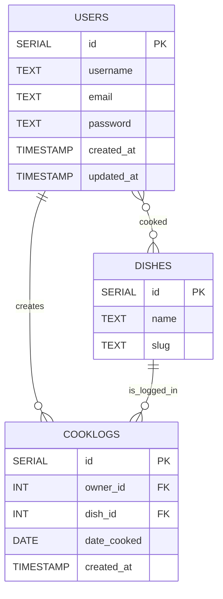

# Data Modeling

---

## Users

| Column | Type | Purpose |
|--------|------|---------|
| `id` | `SERIAL PRIMARY KEY` | Unique identifier for each user |
| `username` | `TEXT UNIQUE NOT NULL` | The user’s chosen display name; must be unique |
| `email` | `TEXT UNIQUE` | Optional field for future account recovery or contact |
| `password` | `TEXT NOT NULL` | Stores the password for authentication |
| `created_at` | `TIMESTAMP` | Records when the user registered |
| `updated_at` | `TIMESTAMP` | Records when the user last changed their data |

## Dishes

| Column | Type | Purpose |
|:--------|:------|:---------|
| `id` | `SERIAL PRIMARY KEY` | Unique dish identifier |
| `name` | `TEXT UNIQUE NOT NULL` | Name of the dish (e.g., “Palak Paneer”) |
| `slug` | `TEXT UNIQUE` | Hyphen separated name of the dish (e.g., "palak-paneer"); useful for URL |

## Cooklogs

| Column | Type | Purpose |
|:--------|:------|:---------|
| `id` | `SERIAL PRIMARY KEY` | Unique identifier for each dish log |
| `owner_id` | `INT REFERENCES users(id)` | Links each log to the user who created it |
| `dish_id` | `INT REFERENCES dishes(id)` | Links to the dish that user cooked |
| `date_cooked` | `DATE NOT NULL` | The date the dish was cooked |
| `created_at` | `TIMESTAMP` | When the log entry was made |

---