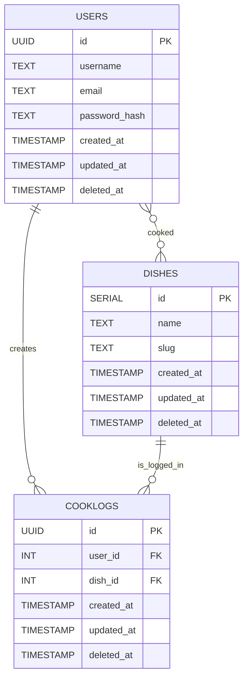

# Data Modeling

Defines the structure and relationships of the database entities that power Kya Saabzi’s core features.

---

---

## Users

| Column | Type | Purpose |
|--------|------|---------|
| `id` | `UUID PRIMARY KEY` | Unique identifier for each user |
| `username` | `TEXT UNIQUE NOT NULL` | The user’s chosen display name; must be unique |
| `email` | `TEXT UNIQUE` | User email for future account recovery or contact |
| `password_hash` | `TEXT NOT NULL` | Stores the password hash for authentication |
| `created_at` | `TIMESTAMP` | Records when the user registered |
| `updated_at` | `TIMESTAMP` | Records when the user last changed their information |
| `deleted_at` | `TIMESTAMP` | Records when was the user data deleted |

## Dishes

| Column | Type | Purpose |
|:--------|:------|:---------|
| `id` | `SERIAL PRIMARY KEY` | Unique dish identifier |
| `name` | `TEXT UNIQUE NOT NULL` | Name of the dish (e.g., “Palak Paneer”) |
| `slug` | `TEXT UNIQUE` | Hyphen separated name of the dish (e.g., "palak-paneer"); useful for URL |
| `created_at` | `TIMESTAMP` | Records when the dish was registered |
| `updated_at` | `TIMESTAMP` | Records when the dish was last changed |
| `deleted_at` | `TIMESTAMP` | Records when the dish was deleted |

## Cooklogs

| Column | Type | Purpose |
|:--------|:------|:---------|
| `id` | `UUID PRIMARY KEY` | Unique identifier for each dish log |
| `user_id` | `UUID REFERENCES users(id)` | Links each log to the user who created it |
| `dish_id` | `INT REFERENCES dishes(id)` | Links to the dish that user cooked |
| `created_at` | `TIMESTAMP` | Records when the log was registered |
| `updated_at` | `TIMESTAMP` | Records when the user last changed their logs |
| `deleted_at` | `TIMESTAMP` | Records when the user deleted their logs |

---